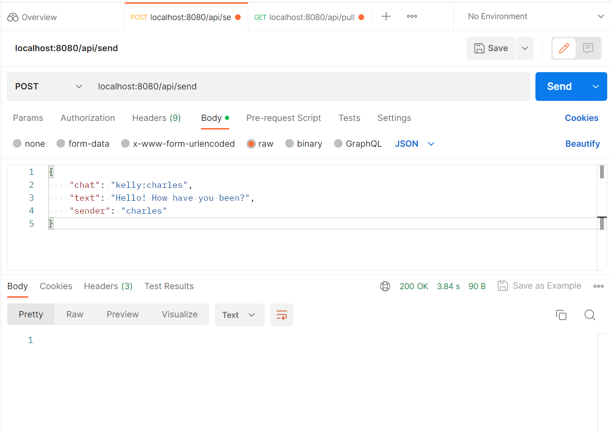
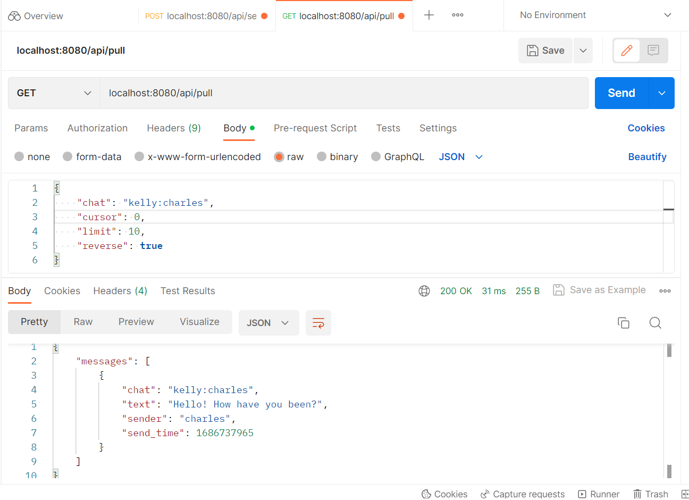
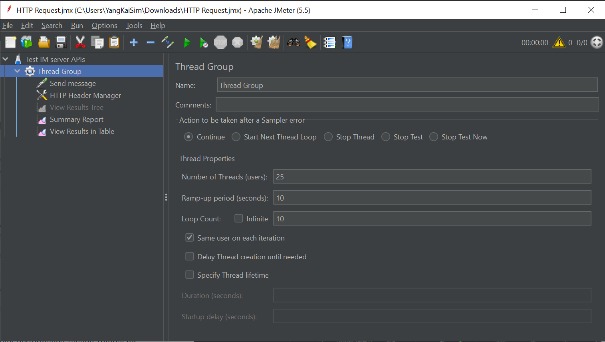
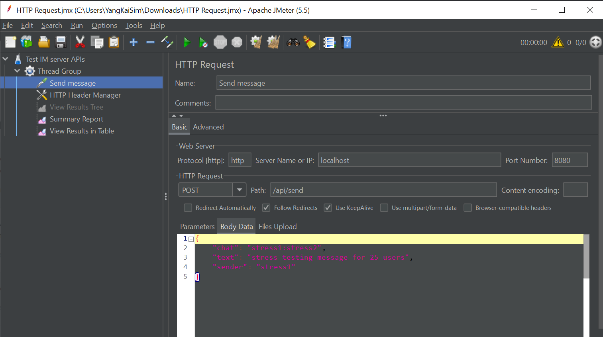
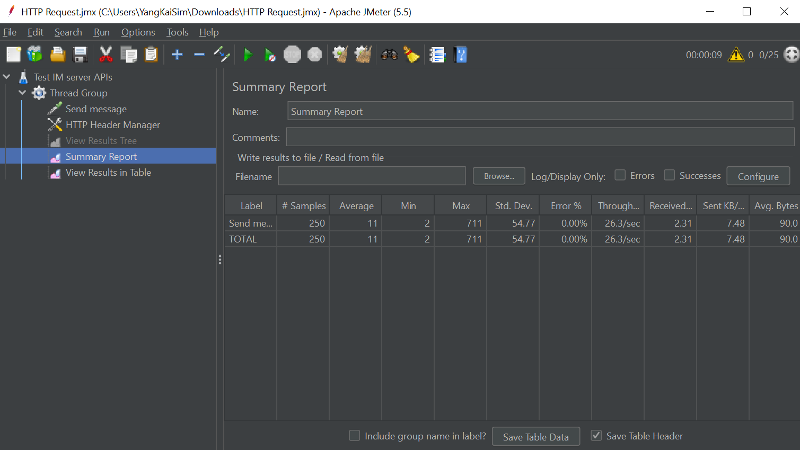
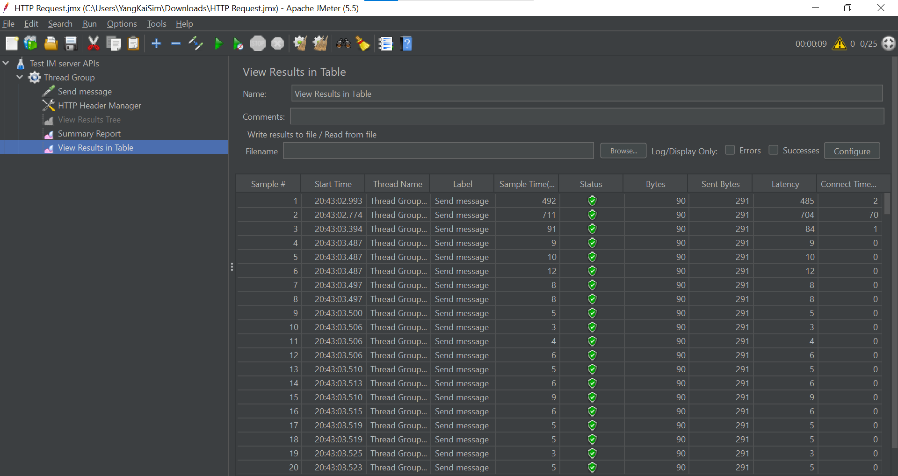

# TiktokTechImAssignment
 Assignment for Tiktok Tech Immersion 2023 
 Special thanks to Tiktok Tech Immersion Team for teaching and guiding! :hugs:

## Testing Send and Pull functions
:envelope: send:

:mailbox_with_mail: pull:

## Testing on JMeter:stopwatch:
Stress testing with 25 users over 10 seconds for 10 loops:

Request Payload:

Summary Report:
Min 2ms with Max 711ms response time:fearful:

Results Table:white_check_mark::

